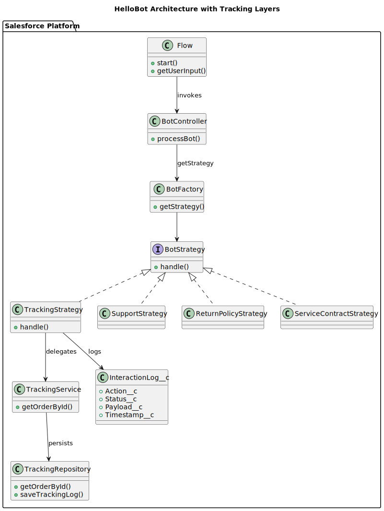

# HelloBot (Salesforce Apex + Flow)

This project implements a chatbot orchestration pattern using Salesforce Flow and Apex, with the Strategy design pattern to manage multiple conversation types.

## Architecture Overview



### ✅ Flow

- User-friendly welcome screen
- Offers choices (tracking, support, etc.)
- Passes user inputs to an Apex Action with parameters

### ✅ BotController

- Single point of entry for Apex logic
- Receives the action and payload from the Flow
- Delegates to the BotFactory to decide the strategy

### ✅ BotFactory

- Contains the routing logic to select the correct strategy
- Returns the appropriate `BotStrategy` implementation

### ✅ Bot Strategies (Strategy Pattern)

- `TrackingStrategy`
- `SupportStrategy`
- `ReturnPolicyStrategy`
- `ServiceContractStrategy`
  
Each strategy implements the common `BotStrategy` interface.

- Strategies **should** be simple, delegating business rules to a *Service* layer.

### ✅ Service Layer

For example:
- `TrackingService` processes the business logic for tracking orders
- The Service delegates to a Repository for persistence

### ✅ Repository Layer

For example:
- `TrackingRepository` handles actual database writes
- It can directly call DML to persist to Salesforce objects

### ✅ InteractionLogger

- A helper component to centralize logging of interactions
- Saves records into the `InteractionLog__c` object

### ✅ InteractionLog__c

Custom object to store:
- Action
- Payload
- Status
- Timestamp
- User

---

## Flow Path in This Repository

The Salesforce Flow metadata for this project is located at:
```
force-app/main/default/flows/Bot_Entry_Flow.flow-meta.xml
```

---

## Test Coverage

This project has an Apex test coverage of approximately **90%**, ensuring a high level of reliability and maintainability.

---

## Setting Up Your Scratch Org

⚠️ **Important:** Salesforce Scratch Orgs are temporary, personal, and non-shareable environments. Each developer must create their *own* Scratch Org to work with this project. Scratch Orgs cannot be reused across users.

To set up your own Scratch Org, follow these steps:

1. Clone this repository:

```
git clone https://github.com/jrs-soft/hello-bot.git
cd hello-bot
```

2. Install the Salesforce CLI and authenticate with your Dev Hub:
```
sfdx force:auth:web:login -d -a DevHub
```

3. Create a new Scratch Org from the project definition file:
```
sfdx force:org:create -s -f config/project-scratch-def.json -a MyScratchOrg
```

4. Push the source code to the new Scratch Org:
```
sfdx force:source:push
```

5. Open the Scratch Org in your browser:
```
sfdx force:org:open
```

6. Each team member should repeat these steps individually to provision their own workspace.

---

## Deployment

You can deploy using Salesforce DX:

```bash
sf project deploy start --source-dir force-app
```

---

## Future Improvements

Here are ideas for enhancing this architecture in future iterations:

### 1️⃣ Logging / Auditing

- Enrich the current `InteractionLogger` to include:
  - response time
  - flow execution context
  - error stack traces (if any)
  - conversation session ID  
- This will provide more complete traceability for debugging and compliance.

---

### 2️⃣ Externalizing Messages

- Move static strings, such as debug logs and user messages, to Salesforce **Custom Labels**.
- This allows easy translation or message changes without modifying Apex code.

---

### 3️⃣ Extensible Strategy Mapping

- Today the `BotFactory` hardcodes the mapping of actions to strategies.
- In future, consider leveraging **Custom Metadata Types** to map `action → Apex class name` dynamically.
- This will make the bot more configurable without code changes.

---

### 4️⃣ External Logging Integrations

- Integrate with Salesforce **Platform Events**, or external tools like ELK / Splunk, to send conversation data in real time.
- This improves monitoring and facilitates analytics beyond the Salesforce UI.

---
